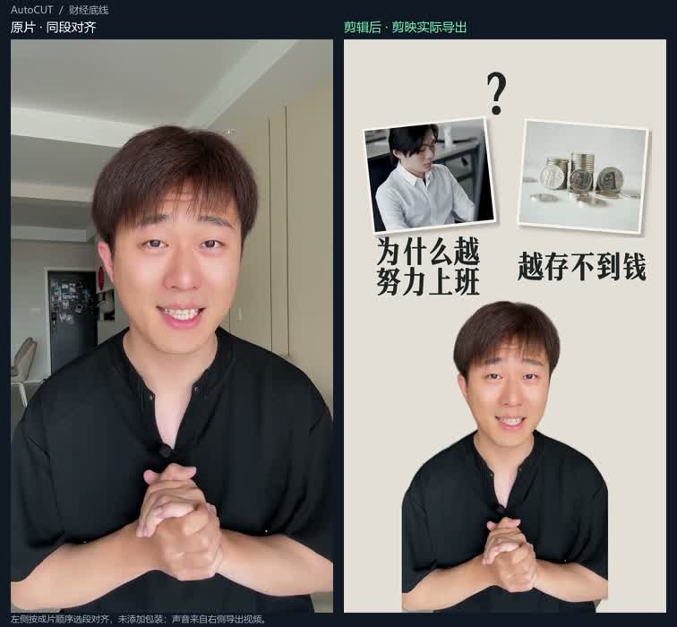

# BlackkeysCut

**AI 辅助口播剪辑，交付可以在剪映里继续修改的原生草稿。**

作者：[Blackkeys0430](https://github.com/Blackkeys0430) · [项目归属](AUTHORS.md) · [许可证](LICENSE)

这是 BlackkeysCut（原 AutoCUT）的独立发布副本，包含当前视频管线源码、测试、创作方法及展示案例。原始口播经过内容整理、粗剪、字幕和声画包装，再由统一 Writer 写入剪映 8.8 测试草稿，交给创作者播放、判断和精修。

当前流程需要 AI Agent 参与内容与设计判断，也依赖本地剪映、转写模型和预设资源；尚不是安装后即可全程无人值守运行的产品。

## 看看实际效果

点击图片查看左右对比：左侧原片按成片选段和顺序对齐，右侧是剪映实际导出；声音来自右侧。

| 财经口播 | 播客分享 | 服装分享 |
| --- | --- | --- |
| [](docs/examples/finance-comparison.mp4) | [](docs/examples/podcast-comparison.mp4) | [](docs/examples/clothing-comparison.mp4) |
| 约45秒 | 约28秒 | 约46秒 |

案例来自开发过程，包含多轮调整，不代表一次运行或完全无人干预的结果。展示视频仅用于说明效果，不作为可自由复用的原始素材库提供。

## 使用条件

- 目前实际使用环境为 Windows + 剪映 8.8。尚未验证 macOS；这里也不提供剪映安装包。
- Python 3.11+、FFmpeg/ffprobe；转写时自行准备 faster-whisper / FunASR 运行环境与本地模型。
- 视频素材、字体、音乐、预设和原生效果资源由使用者自行准备并确认使用权限。预设目录保留能力和结构信息，示例路径已匿名化，不代表本机已有这些资源。
- 建议先用自己的测试素材和独立测试草稿，按照完整管线逐步运行。未知原生效果仍需要本人在剪映中播放确认。

## 从哪里开始

建议使用独立目录，例如 `E:\AutoCUT`。代码本身使用本仓库中的相对入口；文档和资源示例中的 `E:\AutoCUT`、`YOUR_USER` 等需要按实际环境配置。

```powershell
git clone https://github.com/Blackkeys0430/BlackkeysCut.git E:\AutoCUT
cd E:\AutoCUT
python -m venv .venv
.\.venv\Scripts\python.exe -m pip install -e .\jianying-adapter
.\.venv\Scripts\python.exe -m jianying_adapter --version
.\.venv\Scripts\python.exe -m jianying_adapter --help
```

先对合成样例运行只读探测，确认工具入口可用：

```powershell
.\.venv\Scripts\python.exe -m jianying_adapter probe .\jianying-adapter\fixtures\synthetic_draft
```

然后让协作 Agent 阅读 [AGENTS.md](AGENTS.md) 与 [完整管线](jianying-adapter/docs/PIPELINE.md)，明确原片、交付目标和本次写入授权。按 [剪映环境与写入规则](jianying-adapter/docs/JIAN_YING_ENVIRONMENT_AND_PROFILES.md) 配置自己的安装目录、草稿目录和资源。

这一步只是工具安装和只读入口验证，不会自动生成完整视频，也不会自动启动剪映。

## 源码与文档

- [适配层与命令](jianying-adapter/README.md)
- [CandidatePlan 合同](jianying-adapter/docs/CANDIDATE_PLAN_V1.md)
- [素材系统](jianying-adapter/docs/MATERIAL_LIBRARY.md)
- [剪辑手册](reference_videos/analysis/教程统一整理_v1/教程使用说明书_v1.md)
- `scripts/`：本地转写入口；`jianying-adapter/src/`：共享实现；`jianying-adapter/tests/`：已有测试。

剪映原生效果实现文件和本地媒体不随发布副本附带；相关功能仍保留在代码中，运行前需恢复本机合法可用资源。开发期间的原生验收记录与个人工作目录也未打包。

## 授权与反馈

个人本地使用、自媒体创作、给客户剪视频接单允许免费使用。包装成收费软件，或向他人提供在线服务（包括免费在线服务），须事先取得作者书面批准。详见 [LICENSE](LICENSE)。本项目采用自定义源码可见许可，不是标准 MIT / Apache 开源许可。

第三方组件保持各自许可，见 [THIRD_PARTY.md](THIRD_PARTY.md)。

使用问题、意见与授权申请可以提交 [GitHub Issue](https://github.com/Blackkeys0430/BlackkeysCut/issues)。提交问题时请隐藏密钥、客户素材、账号信息和私人路径。
