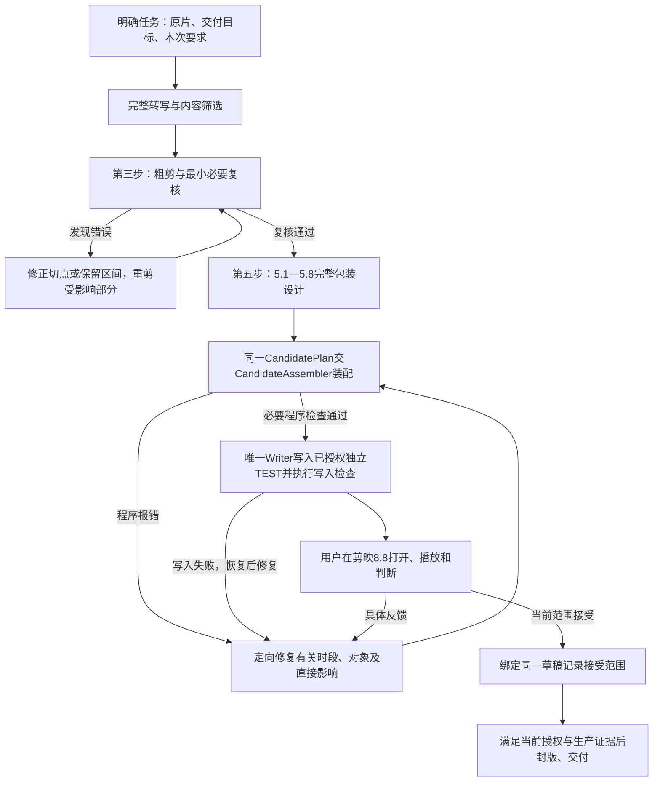

# 获客口播完整管线

当前执行总览，2026-09-13已按用户逐步确认同步第一至第三步及第五步保留步骤；独立5.6取消，5.8只接收已有数据、补齐执行参数并装配，取消独立第八步Agent画面审核，必要程序检查随装配和写入执行。目标是把原始口播做成内容准确、画面清楚、表达完整、可在剪映8.8验收的原生草稿。主代理负责内容与创作判断，共享代码负责准确装配和检查。当前步骤正文优先；2026-09-10的纠偏复核记录（开发参考资料，未随发布副本附带）仅为历史依据。

**先落实开场及段落表现、逐段画面与声音安排、实际关键构图，再装配、写入并交给用户播放审核。** 这些产出复用同一计划，不新增整片核心目标或稳定/变化分布规划。预设、素材、取景和观察需求的技术记录服务于实际交付。总览使用阶段名；“第五步”沿用手册原有约定；原独立第八步画面审核已取消，不重新编号。“第五步”始终指完整包装设计，沿用5.1—5.8中的现行保留步骤，独立5.6已取消。原第6、7步的工作已并入5.4的素材与稳定构图、5.8的资源落地与装配交接，职责未省略；装配完成且必要程序检查通过后，直接衔接已授权写入与用户播放审核。

## 进入第五步前

| 阶段 | 完成的判断与工作 | 实际交接物 |
| --- | --- | --- |
| 明确任务 | 确认原片位置及能否读取、交付目标（如画幅和草稿格式）、本次明确要求及已有授权；已明确的信息直接采用，只在缺失信息会明显影响成品或执行范围时询问 | 必要事实统一保存在当前`project_state.json`，后续阶段引用；不另建重复任务书或需求表 |
| 完整转写与内容筛选 | 只做两件事：把原片说的话转成带时间的文字，通读完整内容，识别疑点由主Agent结合上下文、两路转写和时间信息裁决；筛选有效内容，删掉重录、口误、无意义重复和废话，保留必要的解释、条件、例子、否定、数字与因果。保留片段沿原片讲述顺序，不前置句段或跨段重排；删改不改变原意。人工成片仅供判断与参考，主画面和声音来自原素材 | 准确的带时间转写、按原片顺序排列的保留区间及必要删改理由；交下一阶段生成EDL |
| 粗剪与最小必要复核 | 按原片顺序拼接第二步确认的保留区间，处理切口和停顿，生成粗剪、EDL与源到目标time_map；立即按下述最小复核核对实际结果，发现错误就修正并重剪受影响部分，复核通过后进入包装 | 核对后的粗剪、完整保留台词、有效语义证据、时间映射和基础原生草稿；必要的检查及纠错记录复用当前状态 |

第一步只确认输入和交付要求。接续同一视频时读取其当前状态；新视频不默认读取历史草稿、验收记录或旧Memo，不要求用户先填完整需求表或逐项选择效果。字幕、B-roll、蒙版、特效与声音方案在第五步设计；资源在选用和装配时检查，写入环境由Writer在写入时检查。首次配置、环境变化或具体故障按环境文档处理，不把全环境、全缓存或全预设库检查放进每次开工流程。

### 第三步内的最小必要复核

两路转写分歧由主Agent结合上下文、重复关系与时间信息裁决：区分文字纠正、应剪废弃重录和有意保留的重复。当前执行能力只有转写，没有Agent听音输入；不设Agent回听前置，不要求用户代为转写。主Agent负责有证据支持的内容裁决，也不能只采用流畅文稿就认定音视频已去重。应剪项必须落实到现有edit_plan的实际源区间；使用已有字词时间戳辅助定位切点，检查受影响切口，识别时间戳本身不证明听感。具体字段和自动核对范围见[CandidatePlan合同](CANDIDATE_PLAN_V1.md#重录裁决与实际剪切)。

从结果出发只回答两件事：第二步确定的内容有没有剪对；实际切口和拼接有没有损坏原话、声音或必要画面连续性。复核合并在第三步内，不另设第四步，不重复进行整片内容筛选或重新设计。

1. **对照实际交付。** 对照第二步的保留区间与台词，核对实际粗剪、EDL和时间映射：该留的完整保留、该删的已删除、顺序未变、无漏段或重复拼接。只看计划或转写不能证明剪切正确。
2. **核对切口区间。** 对照字词时间戳、上下文与实际音视频源区间，核对否定条件、应删重录、字词边界和必要动作连续性。识别有疑点时先扩大到整句或相邻段分析，只有现有证据确实不足才补必要识别；正常未改动区间不重复筛选。这些核对不能证明字头字尾、呼吸衔接或声音突变的实际听感，听感由用户成片播放验收。
3. **发现即纠正。** 定位错误时点与原因，修正相关切点或保留区间，用共享粗剪入口重剪受影响部分；更新受影响的EDL、时间映射及证据绑定，核对修正处及相邻接缝的实际源区间和有效转写。工具需要重新输出整条文件时仍保留其他区间决策，不重新选整片内容。已知内容错误须修正后再包装；内容决定已落实、实际区间及证据核对通过即可继续，切口听感标待用户验收，不因Agent无法听音停住整片。

检查范围、具体问题、修正和复核结果简要记入当前`project_state.json.internal_review`或已有对应报告，不另建复核计划、评分表、重复报告或独立验收轮次。如实记录区间与转写核对范围；Agent未听音，不能记为实际听感通过。

当前候选程序仍按[CANDIDATE_PLAN_V1.md](CANDIDATE_PLAN_V1.md)要求绑定同一粗剪的两路实际转写证据，本次流程合并不改变该实现要求。已有与当前粗剪绑定且有效的结果可复用；粗剪文件改变后按现有合同更新证据，不能只平移旧ASR时间戳或把原片证据冒充新粗剪证据。两路识别不能证明切口听感，也不构成额外的独立第四步。

## 第五步：完整包装设计

执行细节以[剪辑手册首版工作法](../../reference_videos/analysis/教程统一整理_v1/教程使用说明书_v1.md#首版工作法)的现行7段16项为准。以下说明各段职责及技术支持放在哪里，不替代手册。 保留原编号，取消独立5.6；所选动效继续由已有步骤和装配执行。

| 原有步骤 | 主代理完成什么 | 共享能力如何服务该步骤 |
| --- | --- | --- |
| 5.1 输入衔接 | 只保留人物动作范围与补充素材表达内容的查看；缺口如实保留 | 直接使用第三步交付的台词和粗剪、第一步记录的画布及本次要求；不重复确认，输入变化时仅核对变化部分 |
| 5.2 开场与段落表现 | 前3秒从少量固定开场模板中选用强视觉冲击表现；识别各段作用，据此选择模板、动效、B-roll、蒙版等实际表现，保持原片讲述顺序 | 复用`creative_brief`及现有选择记录，不独立提炼核心目标或规划稳定/变化分布；阅读时间在5.5落实，动作连续性在5.4设计中保留，程序核对参数与来源，实际观感交用户播放审核，具体见手册 |
| 5.3 表现与台词对时 | 只确定5.2所选表现的起止区间，以及各项内容对应哪句台词、何时出现 | 沿用第三步台词和时间映射，绑定同一`visual_events`的时间与`speech_ids`；选择承接5.2，具体构图排版在5.4—5.5落实 |
| 5.4 素材与稳定构图 | 已有素材直接用、缺的再找；裁好摆好；检查最终构图中的遮挡与动作裁切。沿用已有有效观察与表现选择，不重复判断 | 复用[共享素材系统](MATERIAL_LIBRARY.md)及frame/use交接；普通字幕默认从画面顶部向下约三分之二处稍靠下、整片基本固定，具体位置与局部避让见手册 |
| 5.5 文字信息与阅读 | 填对字；处理模板与普通字幕重复；检查实际文字大小、断行、遮挡及阅读时间，有问题才局部修正 | 模板沿用5.2、时间沿用5.3、位置沿用5.4；完整承载或余字仅属允许省略词时可关闭普通字幕，必要语义仍须保留，具体见手册及CandidatePlan字幕分工规则 |
| 5.7 原配音效沿用与缺口修复 | 原配声音随模板带入，保留音源和声画时序，音量按当前人声调整；漏导入恢复原配，新增效果确实需要声音才补选，适合无声的保持无声 | 有音效与人声时，装配自动执行合同中的同期音量测量，主Agent处理风险；不把原预设增益或本片衰减值当通用值，实际听感交用户播放审核 |
| 5.8 参数落地与候选装配 | 接收已有选择和参数，补齐执行所需参数，装配完整候选草稿；不重复选材、构图或填写交接 | 复用同一CandidatePlan交CandidateAssembler；必要资源/参数检查与操作报错当场处理，必要程序检查通过后直接进入已授权写入，已有有效报告直接复用，不另做Agent截图或切片审核 |

例如，产品比较先判断前缘、夹扣或长度差异是否已经在原片中看清；操作段需要呈现真实动作过程。再决定补近景、对照图、视频或文字。不能用通用的“人物足够”理由消去未交付的具体需求，也不能用静图移动替代连续动作。

Agent提出的实现形式可以改为能完成同一目标的方案，在原计划和现有状态中记录原因、替代方案及实际结果；若降低了用户要求，须先明确提出范围调整。尚未完成的目标继续保留，不能靠删pending封版，不另设需求注销协议。

第五步的三个产出须相互对应：**开场及段落表现、逐段画面与声音安排、实际关键构图**。关键构图以真实画布、素材裁切、字形/媒体/主体保护区包围盒和布局参数承载：5.4—5.5落实构图与文字，5.8直接装配，装配及Writer沿用现有字形、防碰撞及安全区程序检查，已有有效报告不重复生成；不增加独立Agent截图、切片或预览审画面环节，实际观感由用户播放审核。未测原生范围如实记为未检查，几何通过不证明真实观感。具体文案、素材、取景、布局、变化、原配音频和衔接均可直接执行。五类判断融入这些产出及同一计划，不重复填写新一套`design_decisions`使用/省略表，不增加用户逐项选效果的审批。未解决的必要素材或能力继续处理，缺输入或权限只暂停依赖部分。

人物蒙版、圆形/矩形窗口仍以现有双8.8原生参考能力为界。稳定裁切与窗口求解不代表自动抠像、主体跟踪或任意蒙版动画；必要设计遇能力缺口时修复共享能力，或选择能完成同一表达的实现。预设数量、B-roll比例和音效数量不设配额；有效视觉推进按用户确认的2—3.5秒目标设计，由内容决定具体手段。

## 本轮教程能力迭代

用户2026-09-10要求开始迭代并先对齐执行颗粒度。开发范围与进度统一见[画面理解与管线迭代计划](../../reference_videos/analysis/教程学习与管线迭代_20260910/画面理解与管线迭代计划.md)和同目录[28项特效清单](../../reference_videos/analysis/教程学习与管线迭代_20260910/特效教程对应清单.md#执行对齐)：每项及其变体对应教程、当前基础、必要输入、共享依赖、执行路径和实际验证。清单中的待开发能力不能当作已可调用；代表组合只证明它覆盖的范围。

迭代在原步骤落地：5.1/5.4补具体源部位、动作阶段及必要轨迹观察，5.3确定时间、5.4落实构图，5.8承接原配声画关系及额外运动参数，将已有或补齐的共享操作交同一CandidateAssembler，装配及写入保留必要程序检查，实际画面由用户播放审核。局部合成回到现有素材入口；普通倒放与透明前景按真实依赖分别推进。运行参数和开发边界只在[CandidatePlan合同](CANDIDATE_PLAN_V1.md#教程特效扩展的执行边界)与[素材文档](MATERIAL_LIBRARY.md#局部合成与派生素材的开发边界)维护，不新建剪辑入口、平行计划、审美评分或逐段审批。

## 交接与检查怎样使用

技术参数、数据示例和兼容边界集中在[CandidatePlan合同](CANDIDATE_PLAN_V1.md#观察需求到实际交付)及[共享素材系统](MATERIAL_LIBRARY.md)。实际执行按需求调用已有入口，不逐事件机械运行一整串命令。

- **规划时允许待办。** `creative-review PLAN`用于查看缺口，可在需要时调用；它不是第五步的启动或逐段放行门槛。没有实际交付的需求仍保留。`material-requests PLAN`可定位已有素材请求，已有检查结果可复用。
- **只有真实依赖需要顺序处理。** 预设选择保存后才能进入后段查询的已选上下文；查看后由`preset-use`保存取舍。素材检索、源观察和无依赖的构图工作可以独立推进。预设操作参数可在5.8统一落实，不必每选一个预设就装配整片。
- **交接复用同一数据。** `preset-use`保存选择，不生成实际槽位文案或替代operations；构建时核对选择与操作一致。`material-use --plan`已经接回素材操作、B-roll和事件引用，无需再手填一份相同交接。复用已入库素材直接用asset_id进入frame/use，无需重复register。各次计划输出保存在原目录，后续读取最新计划。
- **已查看并选定的交接可批量执行。** `creative-batch`复用现有预设选择、素材入库及交接，按依赖保存到一个当前计划；失败只影响依赖项，续跑跳过已完成项。它不自动代替源查看或审美取舍。需要浏览方向时，`creative-review --storyboard`可从同一计划生成文本分镜，不增加审批阶段。参数只在合同维护。
- **装配前后各核对所需内容。** 新建及整体重做继续使用`visual_planning_version=2`和状态最低版本2；当前v2构建要求整片意图、观察需求及实际绑定。`candidate-preview`调用同一CandidateAssembler，已有装配报告回读需求交付与实际分布；独立的`creative-review PLAN --draft CANDIDATE.json`用于需要时重新核对，已有可核实结果不固定重跑。缺资源、漏交付及Writer硬错误仍须解决。

旧计划可以只读复核，已写草稿不自动迁移。用户要求局部修改时，按下节从对应环节切入；用户明确要求整体重做时，才重新执行完整第五步。

### 局部修改从对应环节切入

接续同一视频的当前状态和最新计划，沿用未受影响的内容、时间与设计，不从第一步重跑。新增蒙版从5.2明确形式和对象，5.3确定区间，5.4落实框内取景与摆位；更换特效从5.2替换所选效果，沿用原区间，必要时调整参数及配套声音；更换字幕预设从5.2选新预设，在5.5复用原文并处理新槽位、字级、断行、阅读时间和普通字幕去重，保留新预设原动画及原配音效。

上述修改统一交5.8装配与唯一Writer，程序只补查失效或受影响结果；用户播放判断效果。修改范围不等于文件生成范围：工具需要重建整份草稿时，复用未受影响的计划；粗剪真的改变时才更新失效的语义证据、时间映射及关联内容，不能复用与新媒体不匹配的旧证据。用户已说明对象和目标且当前信息足够时，不再逐项确认执行参数。

## 2026-09-11历史自动化讨论与实现记录

本节保留历史实现背景；其中旧测试安排不作为当前待办，执行步骤以本页2026-09-13确认后的正文为准。

目标继续是内容准确、主体清楚、声画表达完整的剪映8.8原生草稿。衡量自动化改进看真实制作的介入、耗时、失败恢复和作品质量；命令数量、计划文件大小与预设数量不作为完成指标。选择器已经结合整片与相邻表达生成候选和匹配理由，最终取舍仍结合实际素材、内容职责、阅读、运动与声音，不默认取top-1。

本轮落实四项：修正库摘要生成器的旧批次/候选资格说明；完整查询独立保存并保留可验证引用；现有CLI与批处理记录实际耗时；把必要源内容区接到已有取景和真实crop回读检查。具体格式及兼容边界只在[CandidatePlan合同](CANDIDATE_PLAN_V1.md#观察需求到实际交付)维护。未逐款视觉验收的预设可参与候选，按当前视频检查入选项；明确淘汰项仍拦截，不刷完整个预设库。

搞钱女孩整片测试中另修复两处实际装配问题：批处理保留全部布局与时序操作，只将属于文字预设的操作挂到对应技法；原生预设保存的未启用气泡槽不再被误认成缺失动画，延长时保留原引用，真实效果和未知时序仍按原限制检查。两项修复通过116项相关检查，所选预设继续由本片原生TEST验收。

复用按结论的真实依赖处理：原素材观察依赖素材版本、源区间和查看范围；输出取景依赖源观察、裁切与布局；文字/主体适配还依赖当前文案、字体、时序和同时出现的元素。裁切改变时保留仍有效的源观察，重算当前取景。只结构化程序实际使用的事实，保留语义说明和未知范围；结构合法不等于像素判断正确。

完整编排继续沿用上表的阶段边界：状态与授权→内容裁决→粗剪及语义绑定→5.1—5.8设计与资源→CandidateAssembler（含必要程序检查）→唯一Writer→用户播放审核。定义每阶段输入、产物和恢复点时同时明确可复用范围，由现有素材/检查模块处理具体依赖。本轮仍是现有入口的增量改进，尚未实现原素材到草稿的全链无人值守运行器；通用预设构建器移出旧试验脚本另作行为一致的整理，不作为本轮测试前置。

下一次测试使用一种观看任务下的不同原素材，保持完整设计要求，并记录常规制作与能力修复的耗时差异。观察复用先核对一个真实细节节点：源版本不变时更改安全裁切，保留原观察；裁切切掉关键部位、更换源内容或越过已观察区间时，当前检查应识别问题。之后仍按现有独立TEST流程由用户判断原生声画，不增加逐段审批。

用户指定的蒙版、画面特效及最低次数依[必做画面交付合同](CANDIDATE_PLAN_V1.md#必做画面交付)落到现有操作和实际草稿；本工程以后每条视频至少1处蒙版、3处原生画面特效，只能增加不能减少。先按整片内容设计充分表现，不能每次先限定1+3个槽位或达到下限即停止；下限只防漏做，更高要求照常执行，避免无关效果凑数。

## 装配后的写入与用户验收（独立第八步画面审核已取消）

用户2026-09-13确认取消独立的Agent画面审核步骤：装配后不再专门截图、切片、逐张审图，也不另开预览审画面或整片主观复核。计划与必要执行参数完成后，装配并通过已有必要程序检查，即进入已授权的草稿写入；实际画面、运动、阅读与听感由用户完整播放审核。此前第三步的内容与切口复核、第五步选材和构图所需的源观察仍保留。

资源可读性、参数、语义绑定、字幕、布局、音频及必做项等现有程序检查随装配和Writer执行，直接复用与当前候选绑定的有效结果；不关闭硬门禁，不为这些结果另设人工复查阶段。程序报告的具体错误当场修复并复查受影响部分。`attention_review`等诊断只提供定位信息，不据此新增截图或切片任务，也不将长停留自动判断为质量不合格。程序测量不能证明实际观感或试听通过，未知原生范围保留待用户验收。诊断方法与技术局限见合同。

程序发现确切错误或用户反馈具体问题后进行**定向调整**：明确时段、对象、原因和直接影响，修正相应设计、资源或操作，再从干净基础重建并核对影响。前段预设变化时复核受影响的后段上下文；不默认返回第五步重新设计整片。用户反馈同样进入这个步骤。

写入位置沿用当前项目配置，草稿名按当前任务生成并避免重名覆盖；已有信息明确时不重复向用户确认。保存、登记、恢复副本及写后回读由唯一Writer处理，直接使用当前有效结果，不另开人工复查或启动剪映证明写入成功。

装配及写入所需的程序检查通过后，真实登记使用项目根目录下的[唯一Writer：jianying-adapter/scripts/write_candidate_plan.py](../scripts/write_candidate_plan.py)及`--preview-test`。当前test profile、版本、兼容参考和路径参数遵循[环境与写入规则](JIAN_YING_ENVIRONMENT_AND_PROFILES.md)，不能照抄其他视频的ID或路径。Writer已有进程及文件锁检查，运行中的剪映会阻止写入；按既有授权正常退出，未保存修改或冲突弹窗暂停，不强杀或清锁。随后保留恢复副本，通过E物理路径写入和回读，登记保留宿主C逻辑地址，失败恢复。

交付后仅告知准确草稿名和位置，不自动启动剪映；由用户自行启动剪映8.8、打开、播放和判断实际声画，只有用户当次明确要求时才代为启动。不再安排独立Agent截图、切片审画面或完整试听；原生代播也不是首版已授权TEST写入前提。检查范围、具体问题与调整如实记录在当前`project_state.json.internal_review`；未呈现的原生效果或未听到的声音留给用户验收。文件生成、登记、打开播放和用户接受分别记录。

用户暂定接受按原范围记录。每次TEST写入后由Writer从本次registration同步当前状态的草稿ID、产物路径和待验范围，再把用户反馈绑定到该ID；不沿用旧草稿的接受结论。单片修订和接受记录只更新该片现有状态，共享文档只维护通用执行规则，不追加草稿名、历轮参数或修订报告。生产封版继续满足现行语义、资源、三阶段证据及Writer合同；`completed`须有同一项目/草稿的结构验收、用户视觉通过和空pending。付费、导出、上传、发布、删除及额外GUI操作沿用明确授权边界。工程检查通过不代表作品或用户验收通过。
